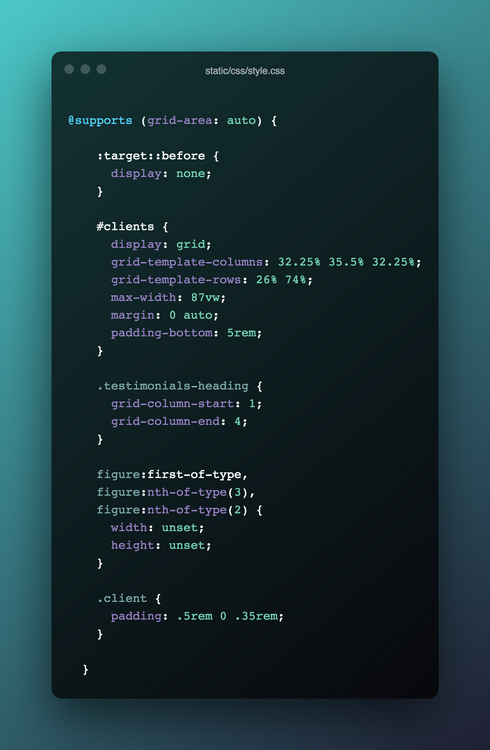

# Sunnyside agency landing page

#### [Live link to deployed project](https://loosenthedark.github.io/frontend-mentor_sunnyside-agency-landing-page) (hosted on GitHub Pages)

#### [Frontend Mentor challenge submission page](https://www.frontendmentor.io/solutions/fullyresponsive-landing-page-made-using-css-flexbox-and-grid-SPP5JREpB)

This is a solution to the [Sunnyside agency landing page challenge on Frontend Mentor](https://www.frontendmentor.io/challenges/sunnyside-agency-landing-page-7yVs3B6ef). Frontend Mentor challenges help you improve your coding skills by building realistic projects.

## Table of contents

- [Overview](#overview)
  - [The challenge](#the-challenge)
  - [Design mockups](#design-mockups)
  - [Screenshots](#screenshots)
  - [Links](#links)
- [My process](#my-process)
  - [Built with](#built-with)
  - [What I learned](#what-i-learned)
  - [Continued development](#continued-development)
  - [Useful resources](#useful-resources)
- [Developer](#developer)
- [Notice](#notice)

## Overview

### The challenge

Users should be able to:

- View the optimal layout for the site depending on their device's screen size ✅
- See hover states for all interactive elements on the page ✅

### Design mockups

_(`jpeg` starter files provided in [Frontend Mentor challenge hub](https://www.frontendmentor.io/challenges/sunnyside-agency-landing-page-7yVs3B6ef/hub/fullyresponsive-landing-page-made-using-css-flexbox-and-grid-SPP5JREpB))_

#### Mobile design:

  

  <b>click to view</b>
  

#### Mobile menu detail:

  

  <b>click to view</b>
  

#### Desktop design:

  

  <b>click to view</b>
  

### Screenshots

### Links

- [GitHub repository](https://github.com/loosenthedark/frontend-mentor_sunnyside-agency-landing-page)
- [Live site](https://loosenthedark.github.io/frontend-mentor_sunnyside-agency-landing-page)

## My process

### Built with

- Semantic HTML5 markup
- CSS custom properties
- Flexbox
- CSS Grid
- Vanilla JavaScript event handling
- Mobile-first workflow
- Responsive web design

### What I learned

- I wanted to have a bit of fun by flipping one of the site's ['Services' `section`](https://loosenthedark.github.io/frontend-mentor_sunnyside-agency-landing-page/#services)'s background images on its head. To achieve this, I had to leverage an absolutely-positioned [`::before` pseudo-element](https://developer.mozilla.org/en-US/docs/Web/CSS/::before). This pseudo-element's `transform` property was then used to perform the desired rotation:

- This was only my second time building out a site incorporating CSS grid, so I found [Morten Rand-Hendriksen](https://twitter.com/mor10)'s [LinkedIn Learning course on this layout method](https://www.linkedin.com/learning/css-advanced-layouts-with-grid) to be an excellent primer. More specifically, his advice on using a [`@supports` CSS at-rule](https://developer.mozilla.org/en-US/docs/Web/CSS/@supports) to check for browser support before conditionally applying Grid styles was something I adhered to within the project's stylesheet:

- I decided to detach the site's `nav` from its `.fixed-top` positioning on tablet and desktop, and instead use a dynamically-displayed 'back-to-top` button on vertical page scroll (> 500px) to aid navigation/UX:

### Continued development

At the time of writing (August 2021), the project's [custom stylesheet](static/css/style.css) contains over 1,500 lines of CSS. It is my intention to refactor and reduce the size of this file at a later date, most likely through targeted use of [CSS Variables](https://www.w3schools.com/css/css3_variables.asp). I will also look to slightly increase font-sizing throughout the site on tablet, as this is looking a bit on the small side at present.

### Useful resources

- ['Fixed page header overlaps in-page anchors'](https://stackoverflow.com/questions/4086107/fixed-page-header-overlaps-in-page-anchors) (Stack Overflow) was used to find a pure CSS workaround for this persistent issue caused by the site's `nav.fixed-top` covering the top portion of each anchor link area
- ['Hey, what about the figure element?'](https://css-tricks.com/quoting-in-html-quotations-citations-and-blockquotes/#hey-what-about-the-figure-element) from [this CSS Tricks article](https://css-tricks.com/quoting-in-html-quotations-citations-and-blockquotes/) was used as a reference in an effort to follow semantic HTML5 best practices when coding the site's ['Client Testimonials' `section`](https://loosenthedark.github.io/frontend-mentor_sunnyside-agency-landing-page/#clients)
- ['How to Apply CSS3 Transforms to Background Images'](https://www.sitepoint.com/css3-transform-background-image/) (SitePoint) was used to rotate one of the background images featured in the site's ['Services' `section`](https://loosenthedark.github.io/frontend-mentor_sunnyside-agency-landing-page/#services) 180 degrees on tablet and desktop ([see above](#what-i-learned))
- ['A Complete Guide to Grid'](https://css-tricks.com/snippets/css/complete-guide-grid/) (CSS-Tricks) was used as a 'cheat sheet' for implementing the site's partial CSS Grid layout on tablet and desktop
- [W3Schools HTML Colour Picker](https://www.w3schools.com/colors/colors_picker.asp) was used for generating on-the-fly colour pairings and modifications (lightening, darkening etc. of core project colours)
- [Box Shadow CSS Generator](https://cssgenerator.org/box-shadow-css-generator.html) was used to gauge the correct amount of `box-shadow` for the site's off-canvas `navbar-nav` menu on mobile
- [PicResize (online image editing tool)](https://picresize.com/) was used to crop and resize images
- [TinyJPG (online image compression tool)](https://tinyjpg.com/) was used for image compression
- [Responsively App](https://responsively.app/) was used to capture video of scrollable device emulators showcasing this solution's responsive mobile-first layout
- [Ezgif](https://ezgif.com/) was then used to convert this video to the `gif` format for inclusion in the [Screenshots](#screenshots) section of this Markdown file
- [Ray.so:](https://ray.so/) was used to create the code block images featured in this Markdown file

## Developer

- [Website](https://loosenthedark.tech/)
- [LinkedIn](https://www.linkedin.com/in/paulharrington05/)
- [GitHub](https://github.com/loosenthedark)
- [Frontend Mentor](https://www.frontendmentor.io/profile/loosenthedark)
- [Twitter](https://twitter.com/loosenthedark)

## Notice

This site has been created for development purposes only.